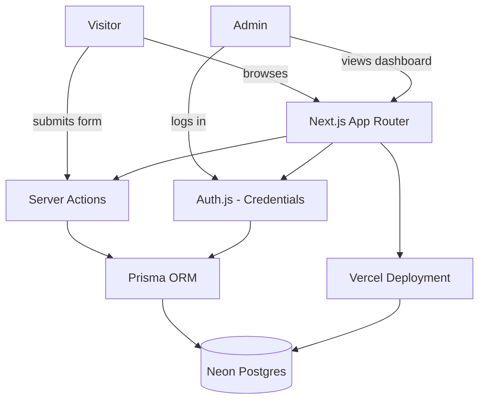

# ARCHITECTURE.md — Flowint AI

## 1. Application Architecture

### Frontend

- **Next.js (App Router)** + TypeScript + Tailwind CSS + shadcn/ui.
- Public marketing pages (`/`, `/solutions`, `/about`, `/contact`) are **Server
  Components** by default — static/near-static content, good SEO, minimal
  client JS.
- The contact/demo form is a small **Client Component** (needs interactivity:
  React Hook Form + Zod, inline validation, submit state) embedded in an
  otherwise server-rendered `/contact` page.
- The admin dashboard (`/dashboard`) uses Server Components to fetch leads
  server-side (no client-side data fetching / loading spinners needed for
  the initial list), with small Client Components for interactive bits
  (status dropdown, delete confirmation).

### Backend

- No separate backend service. Next.js Server Actions handle all mutations:
  - `submitLead` (public — creates a Lead row)
  - `updateLeadStatus`, `deleteLead` (admin-only)
- The only Route Handler needed is Auth.js's catch-all:
  `app/api/auth/[...nextauth]/route.ts`. Everything else goes through Server
  Actions, per the mandatory stack's preference to avoid a separate API layer
  unless necessary — this app doesn't need one.

### Database

- **PostgreSQL via Neon** (recommendation — see "Why Neon" below).
- **Prisma** as the ORM (see "Why Prisma" below).
- Two tables for v1: `Lead` and `AdminUser` (see `docs/DATABASE.md`, Phase 3).

### Authentication

- **Auth.js (NextAuth v5)** with the **Credentials provider**.
- Why not Clerk: Clerk is built around self-service sign-up/sign-in for many
  end users. This app has exactly one user _type_ (a small, manually-seeded
  set of admin accounts) and zero public accounts — Clerk's user-management
  surface (invites, org switching, social logins) is unused overhead here.
  Auth.js with Credentials + a `password` hash column on `AdminUser` is
  simpler, free, and fully under our control.
- Session strategy: JWT (stateless, serverless-friendly — no session table
  needed).
- `middleware.ts` protects `/dashboard/**`, redirecting unauthenticated
  requests to `/login` with a `callbackUrl`.

### File Upload

- Not required for v1 (no images/attachments in the lead form or admin
  dashboard). Noted for future scope only — would use Vercel Blob if added
  later (e.g., allowing a lead to attach a photo of their current Excel
  sheet).

### Deployment

- **Vercel**, connected to this repo's `main` branch for production.
- **Neon Postgres** as the managed database (works natively with Vercel's
  serverless/edge functions; pooled connection string used at runtime,
  direct connection used for migrations).
- Environment variables (see `docs/DEPLOYMENT.md`, created in Phase 5):
  `DATABASE_URL`, `DIRECT_URL`, `AUTH_SECRET`, `NEXTAUTH_URL`.

## 2. Why Prisma over Drizzle

Both are valid per the mandatory stack. Choosing **Prisma** because:

- The schema here is tiny (2 tables) — Prisma's extra runtime weight is a
  non-issue at this scale, while its DX (migrations, Prisma Studio for
  eyeballing leads without building an admin UI first, generated types)
  speeds up early development.
- Drizzle's edge-runtime performance advantage matters more for high-traffic
  or edge-heavy apps; this is a low-traffic marketing site with a handful of
  admin users — not the bottleneck here.
- Prisma Studio doubles as a quick manual lead-inspection tool during
  development, which is genuinely useful before the dashboard UI exists.

## 3. Data Flow

### Flow A — Visitor submits a lead (Contact/Book-a-demo)

```text
User fills contact form (Client Component)
↓
Client-side Zod validation (React Hook Form)
↓
Server Action: submitLead(formData)
↓
Server-side Zod validation (never trust the client)
↓
Business logic: honeypot/rate-limit check
↓
Prisma: insert into Lead table (Neon Postgres)
↓
Return { success, error } to the form
↓
UI shows success state ("We'll be in touch") or field errors
```

### Flow B — Admin logs in

```text
Admin submits credentials on /login (Client Component)
↓
Auth.js Credentials provider (Server Action-backed)
↓
Prisma: look up AdminUser by email
↓
bcrypt compare password hash
↓
Issue JWT session cookie
↓
Redirect to /dashboard (or original callbackUrl)
```

### Flow C — Admin views/updates leads

```text
Admin navigates to /dashboard
↓
middleware.ts verifies session, else redirect to /login
↓
Server Component fetches leads via Prisma (server-side, no API round trip)
↓
Render list + status controls
↓
Admin changes status (Client Component dropdown)
↓
Server Action: updateLeadStatus(leadId, status)
↓
Authorization check: session must be a valid admin
↓
Prisma: update Lead row
↓
Revalidate path, UI reflects new status
```

## 4. Architecture Diagram



## 5. Non-Goals (v1)

- No file/image uploads.
- No public user accounts or self-service sign-up.
- No payments.
- No multi-tenant admin teams/permission tiers — one `AdminUser` role only.
