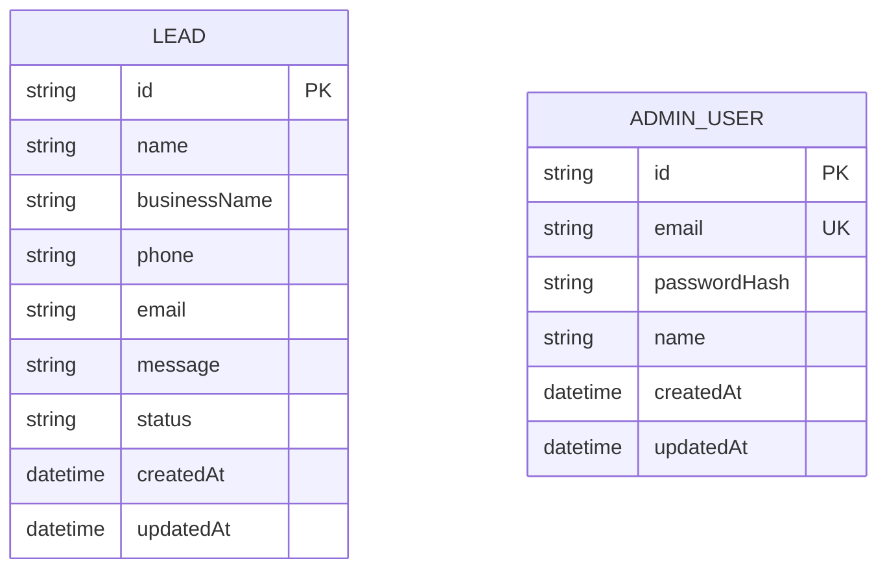

# DATABASE.md — Flowint AI

## 1. Entities

Two entities for v1. They are independent — no foreign key relationship
between them, since admins are not individually attributed to leads in this
version (see Non-Goals in `docs/ARCHITECTURE.md`).

### Lead

A submission from the public contact/demo form — a prospective customer
who wants to be contacted.

### AdminUser

A Flowint AI team member who can log in and manage leads. Manually seeded
(no public sign-up).

## 2. Table Definitions

### `Lead`

| Column       | Type                               | Constraints                                 |
| ------------ | ---------------------------------- | ------------------------------------------- |
| id           | String (cuid)                      | Primary key                                 |
| name         | String                             | Required, max 100 chars                     |
| businessName | String                             | Required, max 150 chars                     |
| phone        | String                             | Required, max 20 chars                      |
| email        | String                             | Required, max 254 chars, valid email format |
| message      | String (text)                      | Required, max 2000 chars                    |
| status       | Enum: `NEW`, `CONTACTED`, `CLOSED` | Required, default `NEW`                     |
| createdAt    | DateTime                           | Default `now()`                             |
| updatedAt    | DateTime                           | Auto-updated on write                       |

**Indexes:**

- Index on `status` (dashboard filters by status).
- Index on `createdAt` (dashboard sorts newest-first by default).

### `AdminUser`

| Column       | Type          | Constraints                             |
| ------------ | ------------- | --------------------------------------- |
| id           | String (cuid) | Primary key                             |
| email        | String        | Required, **unique**, max 254 chars     |
| passwordHash | String        | Required (bcrypt hash, never plaintext) |
| name         | String        | Optional, max 100 chars                 |
| createdAt    | DateTime      | Default `now()`                         |
| updatedAt    | DateTime      | Auto-updated on write                   |

**Indexes:**

- Unique index on `email` (also the lookup key at login).

## 3. Relationships

None in v1 — `Lead` and `AdminUser` are independent tables. No cascading
delete behavior is required as a result.

(If a future version needs to track _which_ admin handled a lead, an
optional `handledById` FK on `Lead` referencing `AdminUser.id` with
`onDelete: SetNull` would be the natural extension — not built now, per
"do not create unnecessary tables/columns.")

## 4. ER Diagram



No relationship lines — the two entities are intentionally unrelated in v1.

## 5. Example Records

**Lead**

```json
{
  "id": "cljb3x9r10000qk3g8h2f1a2b",
  "name": "Ramesh Gupta",
  "businessName": "Gupta General Store",
  "phone": "+91 98765 43210",
  "email": "ramesh@example.com",
  "message": "We track all our stock in Excel and it keeps getting messed up. Want to see if you can help automate this.",
  "status": "NEW",
  "createdAt": "2026-09-05T10:15:00.000Z",
  "updatedAt": "2026-09-05T10:15:00.000Z"
}
```

**AdminUser**

```json
{
  "id": "cljb3xa220001qk3g1d9e7c3d",
  "email": "aditi@flowint.ai",
  "passwordHash": "$2b$10$...",
  "name": "Aditi",
  "createdAt": "2026-09-05T09:00:00.000Z",
  "updatedAt": "2026-09-05T09:00:00.000Z"
}
```

## 6. Implementation Note

This document defines the design only. The actual `prisma/schema.prisma`
file, migrations, and seed script are implemented in **Phase 5, Step 4
(Database Integration)** — once the Next.js project itself is scaffolded
(Phase 5, Step 1) and there's a real project to add Prisma into. Building
the schema file before the project exists would mean creating it in
isolation and re-touching it immediately after.
